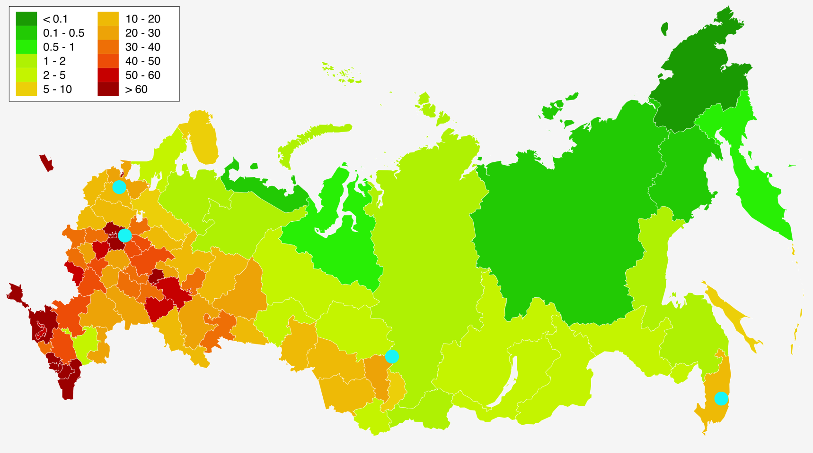

# highload-mail.ru

## Содержание

* ### [Тема и целевая аудитория](#1)
* ### [Расчет нагрузки](#2)
* ### [Глобальная балансировка нагрузки](#3)
* ### [Локальная балансировка нагрузки](#4)

## 1. Тема и целевая аудитория 

**Mail.ru** — почтовый сервис, с возможностью чтения и отправки (с вложениями) писем.

### MVP

- Листинг писем
- Отправка/пересылка писем
- Чтение писем
- Прикрепление файлов(изображений, архивов)
- Удаление писем

### Целевая аудитория

- Россия, страны СНГ
- Месячная аудитория 51 млн человек (+6% относительно 2021 года) [^1]
- Дневная аудитория 25 млн пользователей [^2]

## 2. Расчет нагрузки 

В Почте Mail.Ru размер почтового ящика не ограничен. При регистрации ящика пользователю дается 10 Гб, затем почтовый ящик увеличивается по мере необходимости [^3]. По опыту давних пользователей можно утверждать, что зачастую и 15 Гб бывает мало, поэтом за средний размер одного почтового ящика примем:

    15 GB

Рассмотрим среднестатистического пользователя, пользующийся почтой 8,1 минут в день. 
Для дальнейших расчетов примем следущее:
1) Средний пользователь отправляет в день 1,75 письма(~5KB) [^4]
2) Средний пользователь получает 10 писем  
3) Пользователь заходит в почту 8 раз в день (~ на 1 мин)   
4) Письма с вложениями составляют 30%
5) Среднее количество запросов пользователя за время пребывание в сервисе ~40 согласно статистике
6) Пиковая активность ~ в два раза больше дневной нормы (5.8 * 10^6 * 2 = 11 600 000)
7) За день пользователь просматривает ~1,3 страницы [^7] почтового ящика (25 писем на каждой странице).

Расчитаем общее значение RPS:

      RPS = (5.8 * 10^6 * 40)/(24 * 60 * 60) ~ 2686
      RPS(в контексте загрузки ресурсов) = (5.8 * 10^6 * 500)/(24 * 60 * 60) ~ 30000

### Среднее количество действий пользователя по типам в день (RPS) (согласно MVP)

- <b>Листинг писем</b>

Согласно пунту 7, объем данных 1.3 * 25 * 5 KB = 163 KB:

      RPS = (5.8 * 10^6 * 1.3 * 25)/(24 * 60 * 60) ~ 2181

      Трафик: 2181 * 163 ~ 2 844 024 Kbit/sec ~ 2.7 Gbit/sec

      Пиковое значение (пункт 6): 2 * 2.7 ~ 5.4 Gbit/sec

- <b>Отправка/пересылка писем</b>

Согласно пунту 1, объем данных 1.75 * 5 KB = 9KB:

      RPS = (5.8 * 10^6 * 1.75)/(24 * 60 * 60) ~ 118

      Трафик: 118 * 9 ~ 8496 Kbit/sec ~ 8.5 Mbit/sec

      Пиковое значение (пункт 6): 2 * 8.5 ~ 19 Mbit/sec

- <b>Чтение писем</b>

Согласно пунту 2, объем данных 10 * 5 KB = 50KB:

      RPS = (5.8 * 10^6 * 10)/(24 * 60 * 60) ~ 671

      Трафик: 671 * 50 ~ 268400 Kbit/sec ~ 262 Mbit/sec

      Пиковое значение (пункт 6): 2 * 262 ~ 524 Mbit/sec

- <b>Прикрепление файлов(изображений, архивов)</b>

В среднем 1.75 * 0.33 отправленное письмо имеет вложение(пункт 1), объем данных 1.75 * 0.33 * 500KB = 289KB, тогда:

      RPS = (5.8 * 10^6 * 1,75 * 0,33)/(24 * 60 * 60) ~ 39

      Трафик: 39 * 289 ~ 90168 Kbit/sec ~ 88 Mbit/sec

      Пиковое значение (пункт 6): 2 * 88 ~ 176 Mbit/sec

- <b>Удаление писем</b>

Спам составляет порядка 45.1% от 
полученных писем(на март 2021г) [^5]. Тогда из пункта 2: 10 * 45.1 / 100 = 4.5 . В среднем пользователи почти никогда не удаляют сообщениями, поэтому данная метрику можно отнести к погрешности. В дополнение к этому у большинства почтовых сервисов существуют алгоритмы 
по автоматической очистке спама.

### Финальные результаты

***Трафик***

|Тип запроса| Средний|
|--|--|
| Cредний | 3,05 Gbit/sec |
| Пиковый | 6,1 Gbit/sec |

***RPS***

|Тип запроса| Средний|
|--|--|
| Cредний | 3 009 |
| Пиковый | 6 018 |

## 3. Глобальная балансировка нагрузки 

### Расположение ДЦ

С учетом того, что основными пользователями почты Mail.ru являются россияне, большую часть ДЦ стоит расположить в густо населенных регионах РФ [^6]. 

Итак, у нас будет 4 ДЦ, в Москве и Санкт-Петербурге, для обеспечения почтовых услуг самым густонаселенным территориям, а также ДЦ в Екатеринбурге и Владивостоке для обеспечения быстрого доступа в отдаленных частях страны.

// TODO: какие регионы к какому дц относятся
// TODO: добавить обоснованные измерения (число населения * процент проникновения интернета * процент пользования сервисом = количество юзеров) - узнаю долю на каждый датацентр и посзже пойму в каких пропорциях распределять сервера

### Балансировка нагрузки

// TODO: DNS не нужен, но и про Anycast ничего не понятно (явно расписать схему ёникаста, расписать суть эникаста, посчитать эффект того, что если ближе к дц расположен юер, то туда он и попадет)
// 1. один ДЦ упал - запрос начал идти на следующий по метрике
// несколько дц голосуют за один и тот же айпи адрес
// Почитать за cdn
// можно даже обойтись одним сервером в Москве (лучше так)

Балансировка будет происходить следующим образом:

- DNS-балансировка с помощью GeoDNS для определения региона клиента на основе его географического расположения
- BGP Anycast для определения ближайшего ДЦ в регионе

### Итоговая картина

## 4. Локальная балансировка нагрузки 

После попадания в ДЦ организована L7 балансировка.

В каждом ДЦ четное количество машин с NGINX. Они расположены с использованием VRRP, чтобы при выключении балансировщика включался запасной. До них будет производиться балансировка с помощью протокола динамической маршрутизации BGP Anycast.

Далее NGINX проксирует запросы на сервера посредством алгоритма Weighted Round Robin.

Также выделены отдельные сервера для выдачи файлов.

## Список литературы
[^1]: [Ежемесячная аудитория Почты Mail.ru](https://vk.company/ru/press/releases/11388/)
[^2]: [Обзор Mail.ru Group](https://journal.tinkoff.ru/news/review-mail-ru-group/)
[^3]: [НЕ безлимитный почтовый ящик](https://habr.com/ru/articles/272661/)
[^4]: [How Many Emails Are Sent Per Day In 2023?](https://prosperitymedia.com.au/how-many-emails-are-sent-per-day-in-2021/#:~:text=The%20are%20approximately%205.59%20billion,person%20has%201.75%20email%20accounts)
[^5]: [Monthly share of spam in the total e-mail traffic worldwide](https://www.statista.com/statistics/420391/spam-email-traffic-share/)
[^6]: [Карта плотности населения России](https://www.statdata.ru/karta/plotnost-naseleniya-rossii)
[^7]: [Количество просматриваемых страниц в почте](https://www.similarweb.com/website/mail.ru/#overview)
