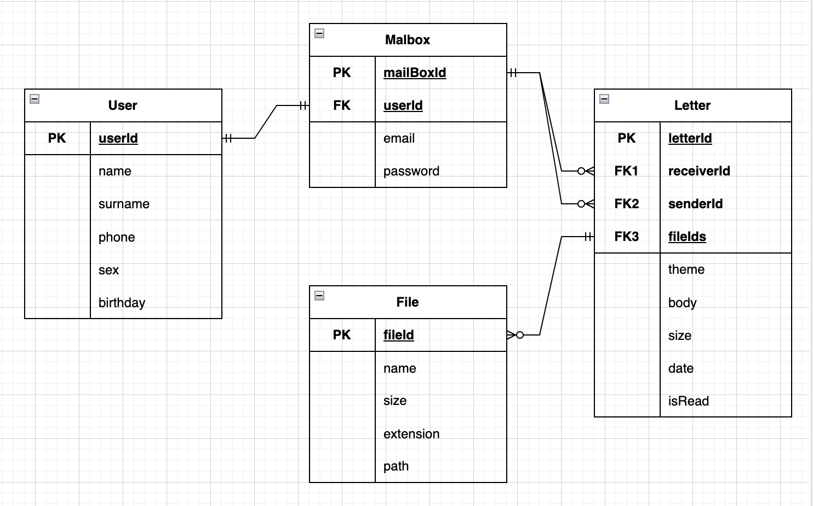

# highload-mail.ru

## Содержание

* ### [Тема и целевая аудитория](#1)
* ### [Расчет нагрузки](#2)
* ### [Глобальная балансировка нагрузки](#3)
* ### [Локальная балансировка нагрузки](#4)
* ### [Логическая схема БД](#5)
* ### [Физическая схема](#6)
* ### [Технологии](#7)

## 1. Тема и целевая аудитория 

**Mail.ru** — почтовый сервис, с возможностью чтения и отправки (с вложениями) писем.

### MVP

- Листинг писем
- Отправка/пересылка писем
- Чтение писем
- Прикрепление файлов(изображений, архивов)
- Удаление писем

### Целевая аудитория

- Россия, страны СНГ
- Месячная аудитория 51 млн человек (+6% относительно 2021 года) [^1]
- Дневная аудитория 25 млн пользователей [^2]

## 2. Расчет нагрузки 

В Почте Mail.Ru размер почтового ящика не ограничен. При регистрации ящика пользователю дается 10 Гб, затем почтовый ящик увеличивается по мере необходимости [^3]. По опыту давних пользователей можно утверждать, что зачастую и 15 Гб бывает мало, поэтом за средний размер одного почтового ящика примем:

    15 GB

Рассмотрим среднестатистического пользователя, пользующийся почтой 8,1 минут в день. 
Для дальнейших расчетов примем следущее:
1) Средний пользователь отправляет в день 1,75 письма(~5KB) [^4]
2) Средний пользователь получает 10 писем  
3) Пользователь заходит в почту 8 раз в день (~ на 1 мин)   
4) Письма с вложениями составляют 30%
5) Среднее количество запросов пользователя за время пребывание в сервисе ~40 согласно статистике
6) Пиковая активность ~ в два раза больше дневной нормы (5.8 * 10^6 * 2 = 11 600 000)
7) За день пользователь просматривает ~1,3 страницы [^7] почтового ящика (25 писем на каждой странице).

Расчитаем общее значение RPS:

      RPS = (25 * 10^6 * 40)/(24 * 60 * 60) ~ 11578
      RPS(в контексте загрузки ресурсов) = (25 * 10^6 * 500)/(24 * 60 * 60) ~ 129310

### Среднее количество действий пользователя по типам в день (RPS) (согласно MVP)

- <b>Листинг писем</b>

Согласно пунту 7, объем данных 1.3 * 25 * 5 KB = 163 KB:

      RPS = (25 * 10^6 * 1.3 * 25)/(24 * 60 * 60) ~ 9401

      Трафик: 9401 * 163 ~ 12 258 904 Kbit/sec ~ 11.7 Gbit/sec

      Пиковое значение (пункт 6): 2 * 11.7 ~ 23.4 Gbit/sec

- <b>Отправка/пересылка писем</b>

Согласно пунту 1, объем данных 1.75 * 5 KB = 9KB:

      RPS = (25 * 10^6 * 1.75)/(24 * 60 * 60) ~ 508

      Трафик: 508 * 9 ~ 36576 Kbit/sec ~ 0.04 Gbit/sec

      Пиковое значение (пункт 6): 2 * 0.04 ~ 0.08 Gbit/sec

- <b>Чтение писем</b>

Согласно пунту 2, объем данных 10 * 5 KB = 50KB:

      RPS = (25 * 10^6 * 10)/(24 * 60 * 60) ~ 2892

      Трафик: 2892 * 50 ~ 1156800 Kbit/sec ~ 1.1 Gbit/sec

      Пиковое значение (пункт 6): 2 * 1.1 ~ 2.2 Gbit/sec

- <b>Прикрепление файлов(изображений, архивов)</b>

В среднем 1.75 * 0.33 отправленное письмо имеет вложение(пункт 1), объем данных 1.75 * 0.33 * 500KB = 289KB, тогда:

      RPS = (25 * 10^6 * 1,75 * 0,33)/(24 * 60 * 60) ~ 169

      Трафик: 169 * 289 ~ 390720 Kbit/sec ~ 0.37 Gbit/sec

      Пиковое значение (пункт 6): 2 * 0.37 ~ 0.74 Mbit/sec

- <b>Удаление писем</b>

Спам составляет порядка 45.1% от 
полученных писем(на март 2021г) [^5]. Тогда из пункта 2: 10 * 45.1 / 100 = 4.5 . В среднем пользователи почти никогда не удаляют сообщениями, поэтому данная метрику можно отнести к погрешности. В дополнение к этому у большинства почтовых сервисов существуют алгоритмы 
по автоматической очистке спама.

### Финальные результаты

***Хранилище***

| Размер хранилища | Среднее количество писем в ящике |
|------------------|----------------------------------|
| 15 GB            | 10000                            |

***Трафик***

| Тип запроса | Листинг писем | Отправка/пересылка писем | Чтение писем | Прикрепление файлов(изображений, архивов) | Суммарный|
|--|--|--|--|--|--|
| Cредний | 11.7 Gbit/sec | 0.04 Gbit/sec | 1.1 Gbit/sec | 0.37 Gbit/sec | 13.2 Gbit/sec |
| Пиковый | 23.4 Gbit/sec | 0.08 Gbit/sec | 2.2 Gbit/sec | 0.74 Gbit/sec | 26.4 Gbit/sec |

// TODO: добавить трафик от скачивания вложений, 5ГБит/сек
// TODO: добавить трафик от статики веб-сайта

***RPS***

| Тип запроса | Листинг писем | Отправка/пересылка писем | Чтение писем | Прикрепление файлов(изображений, архивов) | Средний|
|--|--|--|--|--|--|
| Cредний | 9401 | 508 | 2892 | 169 | 3243 |
| Пиковый | 18802 | 1016 | 5784 | 338 | 6486 |

## 3. Глобальная балансировка нагрузки 

### Расположение 

Так как почта Mail.ru нацелена в первую очередь на рынок РФ, то сервера будут распологаться только в данной стране для лучшего подключения. 

Изучив плотность населения по регионам в РФ[^8], прохождение магистральных кабелей[^9], население федеральных округов[^10], а так же особенности работы почты, можно выбрать одну локацию для размещения единственного дата центра - Москва.

### Нагрузка на дата центр

Рассчитаем процент пользователей для почты Mail.ru от всех жителей России. В России проникновение интернета составляет 88.2%[^11]. Также процент проникновения почты Mail.ru равен 51 / (146 * 0.88) * 100% = 39.7%, тогда коэффициент для пользователей почты равен 88.2% * 0.397 = 35%

## 4. Локальная балансировка нагрузки 

### Вход в дата центр

Каждый балансировщик имеет подключения от 2 свитчей, что увеличит отказоустойчивость системы.

### Балансировка до сервера

После того, как трафик попадает в дата центр, происходит балансировка до NGINX с помощью протокола BGP. Протокол BGP автоматически определяет нагрузку на канал по его использованию. У каждого соединения есть свой вес, который определяет наилучший путь для отправки данных. В процессе передачи данных вес соединения может изменяться, что позволяет протоколу балансировать трафик между различными соединениями.

На балансерах будет организована балансировка при помощи L7 балансировщика. Плюсом данного типа балансировки является то, что у нас будет возможность просматривать конкретные протоколы, а также ставить timeout и следить за падениями определенных серверов. Также, он будет поддерживать persistent connection с серверами, что уберёт задержку при отправке запросов.

На роль L7 балансировщика, а также Proxy будет выбран Nginx.

## 5. Логическая схема БД 

// TODO: по требованиям сделать
// TODO: вместо path - content, а в физической указать, что файлы вынесены в s3-хранилище, а в path - url
// запихать файлы в боди, а то, как решил, уточнить в физической схеме

## 6. Физическая схема 
// TODO: таблица со списком таблиц
// про LevelDB, схема шардинга
// user в reddis
// индексы, денормализация
### Mailbox

mailBoxId | userId  | email       | password    |
--------- | ------- | ----------- | ----------- | 
bigint    | bigint  | varchar(20) | varchar(32) | 

Максимальный вес сущности <b>Mailbox</b> для одного пользователя:

    8 + 8 + 20 + 32 = 68 байт ~ 0,07 Кбайт

### User

userId  | name          | surname      | phone  | sex      | birthday       | 
------  | ------------- | ------------ | ------ | -------- | -------------- |
bigint  | varchar(20)   | varchar(20)  | bigint | bool     | timestamp(UTC) | 

Максимальный вес сущности <b>User</b> для одного пользователя:

    8 + 20 + 20 + 8 + 1 + 4 = 61 байт ~ 0,06 Кбайт

В данной таблице хранится основная информация по пользователе.

### Folder

folderId  | name          | mailBoxId     |
--------- | ------------- | ------------- | 
bigint    | varchar(20)   | bigint        |

Максимальный вес сущности <b>Storage</b>:

    8 + 20 + 8 = 36 байт ~ 0,035 Кбайт

В данной таблице хранятся папки со связью с почтовыми ящиками.
### Letter

letterId  | receiverIds  | senderId         | folderId     | theme       | body             | fileIds         | size | date           | isRead |
------    | ----------- | ---------------- | ------------- | ----------- | ---------------- | --------------- | ---- | -------------- | ------ |
bigint    | bigint array[5]      | bigint   | bigint        | varchar(50) | varchar(1000000) | bigint array[5] | int  | timestamp(UTC) | bool   |

Максимальный вес сущности <b>Letter</b>:

    8 + 8 + 5*8 + 8 + 50 + 1 000 000 + 5*8 + 4 + 4 + 1 = 1 000 163 байт ~ 1 Mбайт

Сервис позволяет отправлять до 5 прикрепленных файлов и до 5 пользователям.

### File

fileId    | name          | size      | extension       | path         |
--------- | ------------- | --------- | --------------- | ------------ |
bigint    | varchar(20)   | int       | varchar(8)      |  varchar(20) |

Максимальный вес сущности <b>File</b>:

    8 + 20 + 4 + 8 + 20 = 60 байт ~ 0,06 Кбайт

В качестве СУБД будет использоваться LevelDB.

Некоторые свойства LevelDB:
* хранилище типа ключ-значение;
* ключ и значение это произвольный массив байт;
* данные хранятся упорядоченно, порядок можно задавать;
* прямой и обратный итератор для обхода данных;
* множественное атомарное обновление;
* поддержка снимков;
* сжатие данных через Snappy.

Данная СУБД позволяет разделить данные каждого пользователя по папкам, что ускоряет выполнение запросов по получению данных пользователя.

Таблица со списком пользователей будет храниться в key-value хранилище в Redis (в LevelDB нет удобной возможности шардинга), а прикрепленные файлы в S3 хранилище 
(Cold boxes - "холодное" хранение, на более медленных и менее дорогостоящих дисках), т.к нет смысла считать все файлы "горячими" (только относительно недавние).

Данные загружаются на сервер со скоростью записи жесткого диска.

## 7. Технологии 

<b>Технологии</b>              | <b>Область применения</b>  | <b>Подробности</b>        | 
------------------------------ | ---------------------------| ---------           |
Golang                         | Бэкенд                     | Низкий порог вхождения, огромная стандартная библиотека, многопоточность из коробки, отличная масштабируемость, принцип Communicating sequential processes(CSP). В качестве роутера, благодаря лучшим показателям по производительности, был выбран fasthttp. Для разбиения приложения на сервисы будет использоваться GRPC как самый оптимальный (Объем передаваемого трафика в Protobuf кратно отличается от передачи данных в формате JSON) | 
TypeScript/JavaScript, CSS,HTML| Фронтенд                   | Самые популярные решения. Под этот стек написано огромное количество библиотек и фреймворков, обширная документация. Технологии уже много лет держат высокий уровень актуальности. Благодаря TypeScript появляется возможность ускорить разработку из-за отлавливания ошибок при компиляции и обезопасить код от непредсказуемого поведения в будущем          |
LevelDB, Redis                 | Системы хранения           | LevelDB позволяет разделить данные каждого пользователя по папкам, что ускоряет выполнение запросов по получению данных пользователя. Таблица со списком пользователей будет храниться в key-value хранилище в Redis (в LevelDB нет удобной возможности шардинга), а прикрепленные файлы в S3 хранилище (Cold boxes - "холодное" хранение, на более медленных и менее дорогостоящих дисках), т.к нет смысла считать все файлы "горячими" (только относительно недавние). |
Nginx                          | Баласировщик               | Благодаря L7 балансировке даже мультиплексируемые клиенты с очень разными трафиками по запросам будут эффективно сбалансированы по бэкендам. Будет использоваться CARP за счет быстрой замены упавших серверов.

Система будет представлять собой микросервесную архитектуру, благодаря которой будет повышена отказоустойчивость и обеспечена разделимость.

В данном проекте подразумевается использование HTTPS и HTTP2 для связи клиента с бэкендом и микросервисов друг с другом (GRPC работает поверх HTTP2).Также будет реализована связь с помощью websocket протокола, для отображения новых пришедших пользователю сообщений в режиме реального времени.

## Список литературы

[^1]: [Ежемесячная аудитория Почты Mail.ru](https://vk.company/ru/press/releases/11388/)
[^2]: [Обзор Mail.ru Group](https://journal.tinkoff.ru/news/review-mail-ru-group/)
[^3]: [НЕ безлимитный почтовый ящик](https://habr.com/ru/articles/272661/)
[^4]: [How Many Emails Are Sent Per Day In 2023?](https://prosperitymedia.com.au/how-many-emails-are-sent-per-day-in-2021/#:~:text=The%20are%20approximately%205.59%20billion,person%20has%201.75%20email%20accounts)
[^5]: [Monthly share of spam in the total e-mail traffic worldwide](https://www.statista.com/statistics/420391/spam-email-traffic-share/)
[^6]: [Карта плотности населения России](https://www.statdata.ru/karta/plotnost-naseleniya-rossii)
[^7]: [Количество просматриваемых страниц в почте](https://www.similarweb.com/website/mail.ru/#overview)
[^8]: [Плотность населения РФ](https://www.statdata.ru/karta/plotnost-naseleniya-rossii)
[^9]: [Магистральные сети связи в России](https://www.comnews.ru/content/211042/2020-10-21/2020-w43/magistralnye-seti-svyazi-rossii)
[^10]: [Население федеральных округов России](https://www.statdata.ru/naselenie-federalnyh-okrugov-rossii)
[^11]: [Global Statistics Russia](https://datareportal.com/reports/digital-2023-russian-federation#:~:text=There%20were%20127.6%20million%20internet,percent%20of%20the%20total%20population.)
