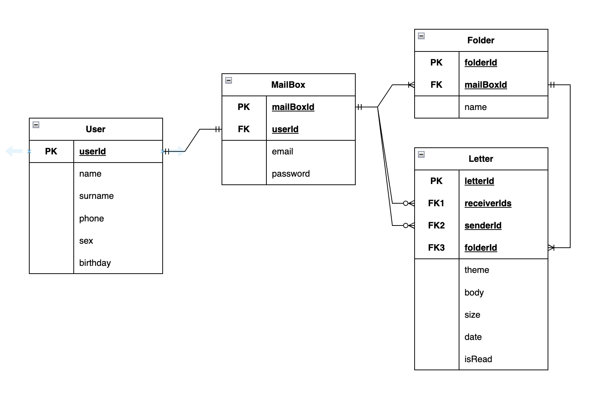
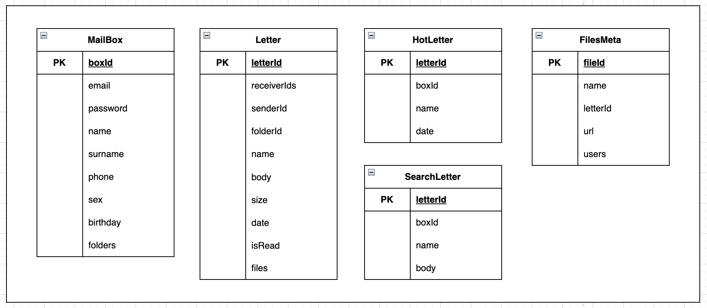
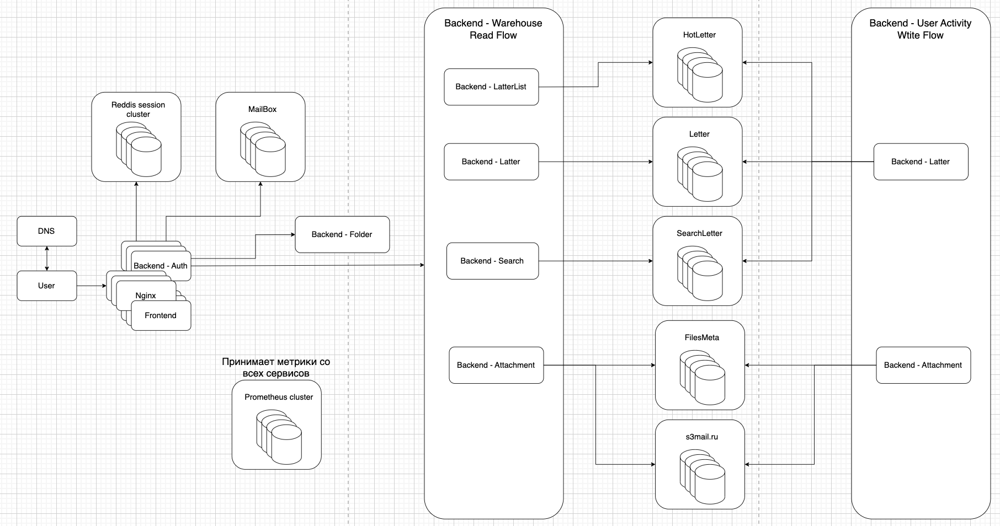

# highload-mail.ru

## Содержание

* ### [Тема и целевая аудитория](#1)
* ### [Расчет нагрузки](#2)
* ### [Глобальная балансировка нагрузки](#3)
* ### [Локальная балансировка нагрузки](#4)
* ### [Логическая схема БД](#5)
* ### [Физическая схема](#6)
* ### [Технологии](#7)
* ### [Схема проекта](#8)
* ### [Обеспечение надежност](#9)
* ### [Расчет ресурсов](#10)

## 1. Тема и целевая аудитория 

**Mail.ru** — почтовый сервис, с возможностью чтения и отправки (с вложениями) писем.

### MVP

- Листинг писем
- Отправка/пересылка писем
- Чтение писем
- Прикрепление файлов(изображений, архивов)
- Удаление писем

### Целевая аудитория

- Россия, страны СНГ
- Месячная аудитория 51 млн человек (+6% относительно 2021 года) [^1]
- Дневная аудитория 25 млн пользователей [^2]

## 2. Расчет нагрузки 

В Почте Mail.Ru размер почтового ящика не ограничен. При регистрации ящика пользователю дается 10 Гб, затем почтовый ящик увеличивается по мере необходимости [^3]. По опыту давних пользователей можно утверждать, что зачастую и 15 Гб бывает мало, поэтом за средний размер одного почтового ящика примем:

    15 GB

Рассмотрим среднестатистического пользователя, пользующийся почтой 8,1 минут в день. 
Для дальнейших расчетов примем следущее:
1) Средний пользователь отправляет в день 1,75 письма(~5KB) [^4]
2) Средний пользователь получает 10 писем  
3) Пользователь заходит в почту 8 раз в день (~ на 1 мин)   
4) Письма с вложениями составляют 30%
5) Среднее количество запросов пользователя за время пребывание в сервисе ~40 согласно статистике
6) Пиковая активность ~ в два раза больше дневной нормы (5.8 * 10^6 * 2 = 11 600 000)
7) За день пользователь просматривает ~1,3 страницы [^7] почтового ящика (25 писем на каждой странице).

Расчитаем общее значение RPS:

      RPS = (25 * 10^6 * 40)/(24 * 60 * 60) ~ 11578
      RPS(в контексте загрузки ресурсов) = (25 * 10^6 * 500)/(24 * 60 * 60) ~ 129310

### Среднее количество действий пользователя по типам в день (RPS) (согласно MVP)

- <b>Листинг писем</b>

Согласно пунту 7, объем данных 1.3 * 25 * 5 KB = 163 KB:

      RPS = (25 * 10^6 * 1.3 * 25)/(24 * 60 * 60) ~ 9401

      Трафик: 9401 * 163 ~ 12 258 904 Kbit/sec ~ 11.7 Gbit/sec

      Пиковое значение (пункт 6): 2 * 11.7 ~ 23.4 Gbit/sec

- <b>Отправка/пересылка писем</b>

Согласно пунту 1, объем данных 1.75 * 5 KB = 9KB:

      RPS = (25 * 10^6 * 1.75)/(24 * 60 * 60) ~ 508

      Трафик: 508 * 9 ~ 36576 Kbit/sec ~ 0.04 Gbit/sec

      Пиковое значение (пункт 6): 2 * 0.04 ~ 0.08 Gbit/sec

- <b>Чтение писем</b>

Согласно пунту 2, объем данных 10 * 5 KB = 50KB:

      RPS = (25 * 10^6 * 10)/(24 * 60 * 60) ~ 2892

      Трафик: 2892 * 50 ~ 1156800 Kbit/sec ~ 1.1 Gbit/sec

      Пиковое значение (пункт 6): 2 * 1.1 ~ 2.2 Gbit/sec

- <b>Скачивание файлов(изображений, архивов)</b>

В среднем 1.3 * 25 * 0.33 полученных письма имеют вложение(пункт 1), объем данных 1.3 * 25 * 0.33 * 500KB = 5363KB, тогда:

      RPS = (25 * 10^6 * 1,3 * 25 * 0,33)/(24 * 60 * 60) ~ 3104

      Трафик: 3104 * 5363 ~ 16 646 752 Kbit/sec ~ 15.9 Gbit/sec

      Пиковое значение (пункт 6): 2 * 15.9 ~ 31.8 Gbit/sec

- <b>Прикрепление файлов(изображений, архивов)</b>

В среднем 1.75 * 0.33 отправленное письмо имеет вложение(пункт 1), объем данных 1.75 * 0.33 * 500KB = 289KB, тогда:

      RPS = (25 * 10^6 * 1,75 * 0,33)/(24 * 60 * 60) ~ 169

      Трафик: 169 * 289 ~ 390720 Kbit/sec ~ 0.37 Gbit/sec

      Пиковое значение (пункт 6): 2 * 0.37 ~ 0.74 Mbit/sec

- <b>Удаление писем</b>

Спам составляет порядка 45.1% от 
полученных писем(на март 2021г) [^5]. Тогда из пункта 2: 10 * 45.1 / 100 = 4.5 . В среднем пользователи почти никогда не удаляют сообщениями, поэтому данная метрику можно отнести к погрешности. В дополнение к этому у большинства почтовых сервисов существуют алгоритмы 
по автоматической очистке спама.

### Финальные результаты

***Хранилище***

| Размер хранилища | Среднее количество писем в ящике |
|------------------|----------------------------------|
| 15 GB            | 10000                            |

***Трафик***

| Тип запроса | Листинг писем | Отправка/пересылка писем | Чтение писем | Скачивание файлов(изображений, архивов) | Прикрепление файлов(изображений, архивов) | Суммарный |
|--|--|--|--|--|--|--|
| Cредний | 11.7 Gbit/sec | 0.04 Gbit/sec | 1.1 Gbit/sec | 15.9 Gbit/sec | 0.37 Gbit/sec | 29.1 Gbit/sec |
| Пиковый | 23.4 Gbit/sec | 0.08 Gbit/sec | 2.2 Gbit/sec | 31.8 Gbit/sec | 0.74 Gbit/sec | 58.2 Gbit/sec |

***RPS***

| Тип запроса | Листинг писем | Отправка/пересылка писем | Чтение писем | Скачивание файлов(изображений, архивов) | Прикрепление файлов(изображений, архивов) | Суммарный |
|--|--|--|--|--|--|--|
| Cредний | 9401 | 508 | 2892 | 3104 | 169 | 10074 |
| Пиковый | 18802 | 1016 | 5784 | 6208 | 338 | 20148 |

## 3. Глобальная балансировка нагрузки 

### Расположение 

Так как почта Mail.ru нацелена в первую очередь на рынок РФ, то сервера будут распологаться только в данной стране для лучшего подключения. 

Изучив плотность населения по регионам в РФ[^8], прохождение магистральных кабелей[^9], население федеральных округов[^10], а так же особенности работы почты (пользователям не так важна реактивность и динамичность, а также почта толерантна к высокой latency, то есть если пользователю с Владивостока придет письмо на 1-2 секунды позже, он этого даже не почувствует), можно выбрать одну локацию для размещения единственного дата центра - Москва.

## 4. Локальная балансировка нагрузки 

### Вход в дата центр

Каждый балансировщик имеет подключения от 2 свитчей, что увеличит отказоустойчивость системы.

### Балансировка до сервера

После того, как трафик попадает в дата центр, происходит балансировка до NGINX с помощью протокола ECMP (режим per flow - в рамках одной сессии tcp всегда будет балансироваться на один и тот же сервер). Хэширование по 5-touple: 
1. source ip
2. destination ip
3. source port
4. destination port
5. protocol
6. hash (соль от каждого узла, чтобы исключить поляризацию)

На балансерах будет организована балансировка при помощи L7 балансировщика. Плюсом данного типа балансировки является то, что у нас будет возможность просматривать конкретные протоколы, а также ставить timeout и следить за падениями определенных серверов. Также, он будет поддерживать persistent connection с серверами, что уберёт задержку при отправке запросов.

На роль L7 балансировщика, а также Proxy будет выбран Nginx.

## 5. Логическая схема БД 

### Mailbox

mailBoxId | userId  | email       | password    |
--------- | ------- | ----------- | ----------- | 
bigint    | bigint  | varchar(20) | varchar(32) | 

Максимальный вес сущности <b>Mailbox</b> для одного пользователя:

    ~ 2.25 Кбайт

### User

userId  | name          | surname      | phone  | sex      | birthday       | 
------  | ------------- | ------------ | ------ | -------- | -------------- |
bigint  | varchar(20)   | varchar(20)  | bigint | bool     | timestamp(UTC) | 

Максимальный вес сущности <b>User</b> для одного пользователя:

    ~ 4.5 Кбайт

В данной таблице хранится основная информация по пользователе.

### Folder

folderId  | name          | mailBoxId     |
--------- | ------------- | ------------- | 
bigint    | varchar(20)   | bigint        |

Максимальный вес сущности <b>Storage</b>:

    ~ 1 Кбайт

В данной таблице хранятся папки со связью с почтовыми ящиками.
### Letter

letterId  | receiverIds  | senderId         | folderId     | theme       | body             | size | date           | isRead |
------    | ----------- | ---------------- | ------------- | ----------- | ---------------- | ---- | -------------- | ------ |
bigint    | bigint array[5]      | bigint   | bigint        | varchar(50) | varchar(1000000) + files | int  | timestamp(UTC) | bool   |

Максимальный вес сущности <b>Letter</b>:

    8 + 8 + 5*8 + 8 + 50 + 1 000 000 + 5 * 5 * 1024^2 + 5*8 + 4 + 4 + 1 = 26 Mбайт

### Размеры данных и нагрузки на чтение/запись

| Тип запроса | Листинг писем | Отправка/пересылка писем | Чтение писем | Скачивание файлов(изображений, архивов) | Прикрепление файлов(изображений, архивов) |
|--|--|--|--|--|--|
| Cредний | 9401 | 508 | 2892 | 3104 | 169 |
| Пиковый | 18802 | 1016 | 5784 | 6208 | 338 |

|    Таблица     |   Нагрузка   |
|----------------|--------------|
| Letter         | 16 074       |
| MailBox        | 9 909        |
| User           | 2 000        |
| Folder         | 3 000        |

|    Таблица     |    Объем     | Количество строк |
|----------------|--------------|------------------|
| Letter         | 1 000 PB     | 71.5 млрд        |
| MailBox        | 300 GB       | 70 млн           |
| User           | 600 GB       | 70 млн           |
| Folder         | 250 GB       | 250 млн          |

## 6. Физическая схема 

Таблица | Решение | Технология | Индексы | Шардинг |
------- | ------- | ---------- | ------- | ------- |
MailBox | Денормолизуем бд, убрав таблицу таблицу User и перенеся все поля в таблицу MailBox, также перенесем сюда же содержимое таблицы Folders в виде [{ folderId, name }] | postgresql | email | email |
Letter  | В таблице Letter добавим поле files, в котором хранится массив структур прикрепленных к письму файлов ({ id файла, имя файла }) | postgresql | - | email |
HotLetter | Для быстрой выдачи последних писем, выделим отдельную таблицу с названием и телом письма | postgresql | date | email |
SearchLetter | Для полнотекстового поиска писем по немполному совпадению используем Elasticsearch | elasticsearch | name, body | email |
FilesMeta | Необходимо хранить мета-данные файла, такие как имя, url в s3, id письма для проверки доступа к файлу, а также массив пользователей, имеющих доступ к файлу | postgresql | url | url |
Files   | Файлы хранить в kv blob-storage (s3) | s3mail.ru (собственное) | - | url |
Sessions | Сессии пользователей | Reddis | - | session_id |

### Размеры данных и нагрузки на чтение/запись

|    Таблица     |   Нагрузка   |
|----------------|--------------|
| MailBox        | 12 000       |
| Letter         |  3 500       |
| HotLetter      | 13 000       |
| SearchLetter   |  9 000       |
| FilesMeta      |  7 000       |
| Files          |  7 000       |

|    Таблица     |    Объем     | Количество строк |
|----------------|--------------|------------------|
| MailBox        |     1 TB     |  70 млн          |
| Letter         |   350 TB     |  71.5 млрд       |
| HotLetter      |    35 TB     |  7.15 млрд       |
| SearchLetter   |   150 TB     |  71.5 млрд       |
| FilesMeta      |   200 TB     | 214.5 млрд       |
| Files          | 1 000 PB     | 214.5 млрд       |

## 7. Технологии 

| Технология  | Область применения | Обоснование |
| ----------- | ------------------ | ----------- |
| React       | Библиотека Frontend            | Ускорит процесс разработки, так как яляется распространенным решением с хорошей документацией и значительным количеством умелых разрабочтиков, знающих данный фреймворк |
| Go          | Backend                        | Простота языка, удобные тулзы из коробки, высокая утилизация CPU, большое комьюнити разработчиков |
| Redis       | Backend                        | In-memory БД позволяет обеспечить высокую скорость на чтение и запись, также с шардированием из коробки |
| PostgreSQL  | Хранение данных сущностей      | Обладает хорошей функциональностью и поддержкой, также при правильном ручном шардировании показывает высокие результаты по производительности и нагрузкам |
| Elasticsearch | Хранение писем для поиска    | Является отличным выбором для полнотекстового поиска по письмам в проекте, так как он предоставляет мощные возможности индексации и поиска текстовых данных |
| s3mail.ru     | Хранение вложенных файлов      | Собственное s3-хранилище, обладающее сравнительно неплохими показателями производительности как на чтение, так и на запись, а также обеспечивающее высокую масштабируемость |
| Nginx       | Web-server Reverse proxy       | Комерческий стандарт, большая функциональность, полезная проекту почты (например, авторизация) |
| GitLab      | Система контроля версий, CI/CD | Комерческий стандарт, командная разработка, pipelines |
| Kubernetes  | Deploy                         | Масштабируемая система deploy с высокой надежностью, отказоустойчивостью и доступностью, что гарантирует бесперебойную работу приложения |
| Docker      | Виртуализация                  | Локальная разработка, унификация процессов | 

## 8. Схема проекта 

## 9. Обеспечение надежности 

| Базы данных             | Критерии надежности |
| ----------------------- | ------------------- |
| PostgreSQL              | Асинхронная master-slave репликация с использованием Patroni и etcd. Резервное копирование, снапшоты и xlog-и (binlog, wal) для восстановительных операций |
| Elasticsearch           | Надежность этих данных требуется высокая, поэтому нам придется делать по 1 реплики к каждому серверу |
| s3mail.ru               | Надежность этих данных также требуется высокая, но объем данных слишком высок, поэтому придется делать по 1 реплики к каждому серверу |
| Redis                   | По 2 реплики к каждому серверу |

- В системе используем N + 1 резервирование. То есть все бекенды, балансеры и хранилища резервируются как общее количество машин + 1.
- Нескольких ДЦ в Москве, в случае отказа одного, трафик перейдёт на другой - fallback на GEOIP DNS, если датацентр не отвечает. 
- Для сбора и просмотра метрик внутри и между ДЦ будет использоваться Prometheus. Если метрики не будут приходить в течении 10 секунд, то ближайший ДЦ поменяет настройки ДНС.
- 2 входных роутера, а также реплики всех критических компонентов в системе.
- Использование Kubernetes (k8s):
  - Позволяет минимизировать время простоя приложений, так как оркестратор масштабирует сервисы на основе текущей нагрузки.
  - Stateless поды обладают эфимерностью, что позволяет легко воспроизводить и перезапускать их.
  - Для обновления приложений можно использовать Rolling updates, при которых поды с новой версией заменяются на поды со старой версией без простоя.
  - Liveness и readiness пробы от kubelet помогают гарантировать правильную работу подов.
  - Etcd:
    - Обеспечивает согласованность и доступность данных.
    - Требует, чтобы большинство узлов согласовалось с изменениями, прежде чем они будут сохранены.
    - Надежность обеспечивается при наличии (n / 2) + 1 живых узлов, каждый из которых хранит копию узла-лидера.

## 10. Расчет ресурсов 

### Распределение ресурсов по сервисам

| Сервис     | Целевая пиковая нагрузка приложения | CPU   | RAM     |
| ---------- | ----------------------------------- | ----- | ------- |
| LetterList | 19 000                              | 1 900 | 186 GB  |
| Letter     | 10 000                              |   100 |  10 GB  |
| Auth       | 30 000                              |   150 |   2 GB  |
| Search     | 10 000                              | 1 000 |  98 GB  |
| Attachment | 20 000                              |   200 |  20 GB  |

### Конфигурация серверов

| Сервис         | Конфигурация                                                 | Cores | Cnt | Плата   |
| -------------- | ------------------------------------------------------------ | ----- | --- | -------- |
| LetterList     | CyberServe EPYC EP1-102 / AMD EPYC 7573X - 32 Cores /  1x8GB |  32   | 60  | €  8 212 |
| Letter         | CyberServe EPYC EP1-102 / AMD EPYC 7573X - 32 Cores /  1x8GB |  32   | 4   | €    550 |
| Auth           | CyberServe EPYC EP1-102 / AMD EPYC 7573X - 32 Cores /  1x8GB |  32   | 6   | €    826 |
| Search         | CyberServe EPYC EP1-102 / AMD EPYC 7573X - 32 Cores /  1x8GB |  32   | 32  | €  4 400 |
| Attachment     | CyberServe EPYC EP1-102 / AMD EPYC 7573X - 32 Cores /  1x8GB |  32   |  7   | €  1 000 |
| Балансировщики | CyberServe EPYC EP1-102 / AMD EPYC 7573X - 32 Cores /  1x8GB |  24   | 90  | € 12 318 |
| Elasticsearch  | CyberStore 472S 12GB/s Storage Server / Intel Xeon Silver 4316 Processor 20 Cores /  RAM 16x128GB / HDD 72x2.4TB |  20   |     5 | €      1 500  |
| PostgreSQL     | CyberStore 472S 12GB/s Storage Server / Intel Xeon Silver 4316 Processor 20 Cores /  RAM 16x128GB / HDD 72x2.4TB |  20   |    10 | €      3 000  |
| Reddis         | CyberStore 212S 12GB/s Storage Server / Intel Xeon Silver 4310 Processor 12 Cores /  RAM 8x8GB / HDD 1x1TB       |  12   |     5 | €        500  |
| s3mail.ru      | CyberStore 472S 12GB/s Storage Server / Intel Xeon Silver 4316 Processor 20 Cores /  RAM 16x128GB / HDD 72x20TB  |  20   |   710 | €    190 500  |

## Список литературы

[^1]: [Ежемесячная аудитория Почты Mail.ru](https://vk.company/ru/press/releases/11388/)
[^2]: [Обзор Mail.ru Group](https://journal.tinkoff.ru/news/review-mail-ru-group/)
[^3]: [НЕ безлимитный почтовый ящик](https://habr.com/ru/articles/272661/)
[^4]: [How Many Emails Are Sent Per Day In 2023?](https://prosperitymedia.com.au/how-many-emails-are-sent-per-day-in-2021/#:~:text=The%20are%20approximately%205.59%20billion,person%20has%201.75%20email%20accounts)
[^5]: [Monthly share of spam in the total e-mail traffic worldwide](https://www.statista.com/statistics/420391/spam-email-traffic-share/)
[^6]: [Карта плотности населения России](https://www.statdata.ru/karta/plotnost-naseleniya-rossii)
[^7]: [Количество просматриваемых страниц в почте](https://www.similarweb.com/website/mail.ru/#overview)
[^8]: [Плотность населения РФ](https://www.statdata.ru/karta/plotnost-naseleniya-rossii)
[^9]: [Магистральные сети связи в России](https://www.comnews.ru/content/211042/2020-10-21/2020-w43/magistralnye-seti-svyazi-rossii)
[^10]: [Население федеральных округов России](https://www.statdata.ru/naselenie-federalnyh-okrugov-rossii)
[^11]: [Global Statistics Russia](https://datareportal.com/reports/digital-2023-russian-federation#:~:text=There%20were%20127.6%20million%20internet,percent%20of%20the%20total%20population.)
[^12]: [redis_bench](https://gist.github.com/sfc/216135)
[^13]: [bench](https://habr.com/ru/post/163979/)
[^14]: [nginx_test](https://www.nginx.com/blog/testing-the-performance-of-nginx-and-nginx-plus-web-servers/)
[^15]: [CARP](https://en.wikipedia.org/wiki/Common_Address_Redundancy_Protocol)
